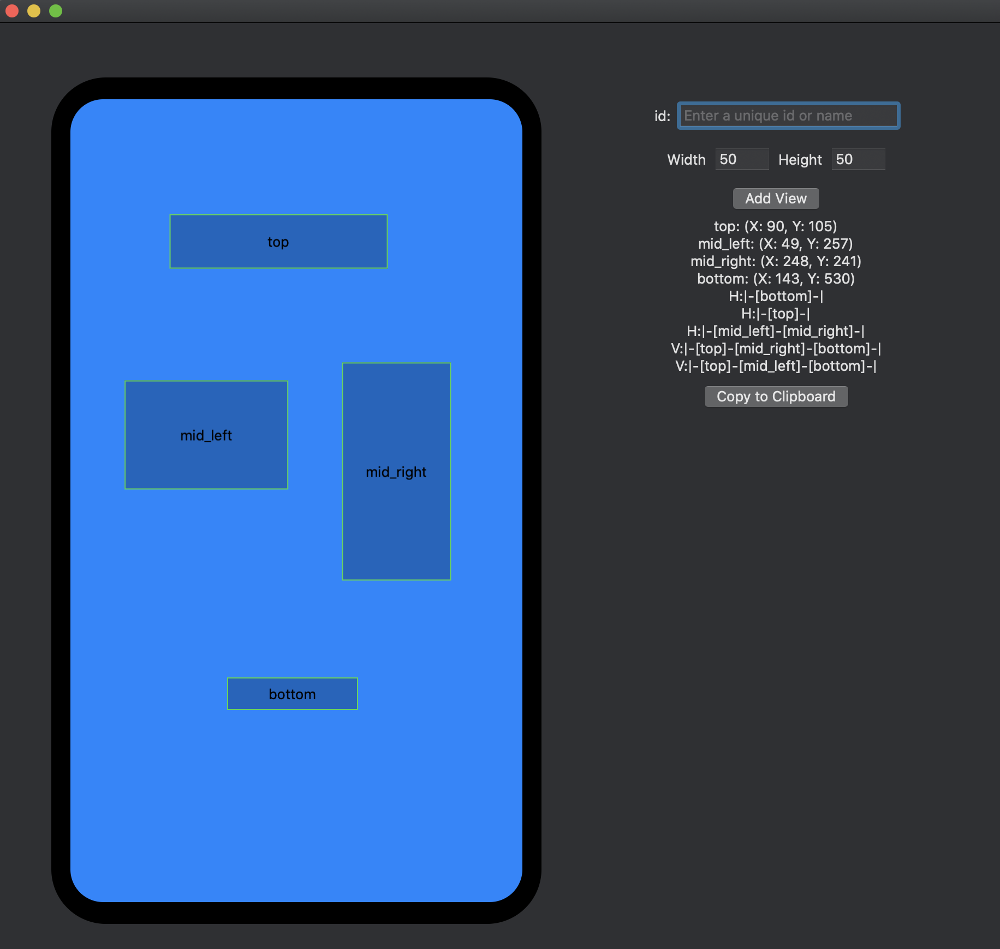

# Auto Layout Visual Format
---
## What is this?

This should make it easier to create views from code, and easier to transmit layouts in json.

The purpose of this project is to better understand Auto Layout Visual Format and to make it easier to use. Ironically this project is made in SwiftUI for macOS. This single page app creates Visual Format Strings that are only useful for what SwiftUI is intended to replace.

[Here is the Apple Auto-Layout Visual Format Documentation](https://developer.apple.com/library/archive/documentation/UserExperience/Conceptual/AutolayoutPG/VisualFormatLanguage.html)

## How to use the app
---
Create views, then drag, tap, double table, long press, and arrange them to create Visual Format Strings



## Examples
---
```
H:|-(bottom==100)-|
H:|-(top==100)-|
H:|-(left_mid==50)-(right_mid==100)-|
V:|-(top==100)-(right_mid==100)-(bottom==100)-|
V:|-(top==100)-(left_mid==50)-(bottom==100)-|
```

## Visual Format Grammar
---
### Syntax:

* Orientation
    * Optional, ignoring this implies horizontal
    * `H:` or `V:`
* Superview
    * Optional, ignoring this could lead to unexpected views
    * `|` No hyphen suggests the view should touch the superview/container
    * `|-`, or `-|` A hyphen provides >=8 units of space away from the superview/container
* Connection
    * Optional, ignoring this will cause a few things
        * `H:|(view)` The view will hug the container on the left side
        * `(view)(other_view)` The view will hug the other_view
    * `-` A single hyphen will provide some default amount of padding depending on the other side of the view
    * `-units@priority-` This will create a distance of the number of units at the given priority
* View
    * `(unique_id_string)` This will relate to a view of the same name, the id string should be unique
    
```
(<orientation>:)?(<superview><connection>)?<view>(<connection><view>)*(<connection><superview>)?
```
#### Another Explanation:
* ? indicates 0 or 1 are allowed
* Asterisk(*) indicates 1 or more are necessary
* orientation: `H:`, `V:`
* superview: `|`
* connection: ``, `-`, `-(value)-`
* view: `[unique_string_id(relation)]`
* relation: todo, basically width or height of a view would be `H:[viewName(==width)]` or `V:[viewName(>=minHeight)]`

## Error Handling
---
If you make a syntactic mistake, an exception is thrown with a diagnostic message. For example:
```
Expected ':' after 'V' to specify vertical arrangement
V|[backgroundBox]|
 ^
 
A predicate on a view's thickness must end with ')' and the view must end with ']'
|[whiteBox1][blackBox4(blackWidth][redBox]|
                                 ^
 
Unable to find view with name blackBox
|[whiteBox2][blackBox]
                     ^
 
Unknown relation. Must be ==, >=, or <=
V:|[blackBox4(>30)]|
               ^
```


# TODO:
* Relations
* Predicates and Predicate Lists
* Priority
* Metrics
* Examples
